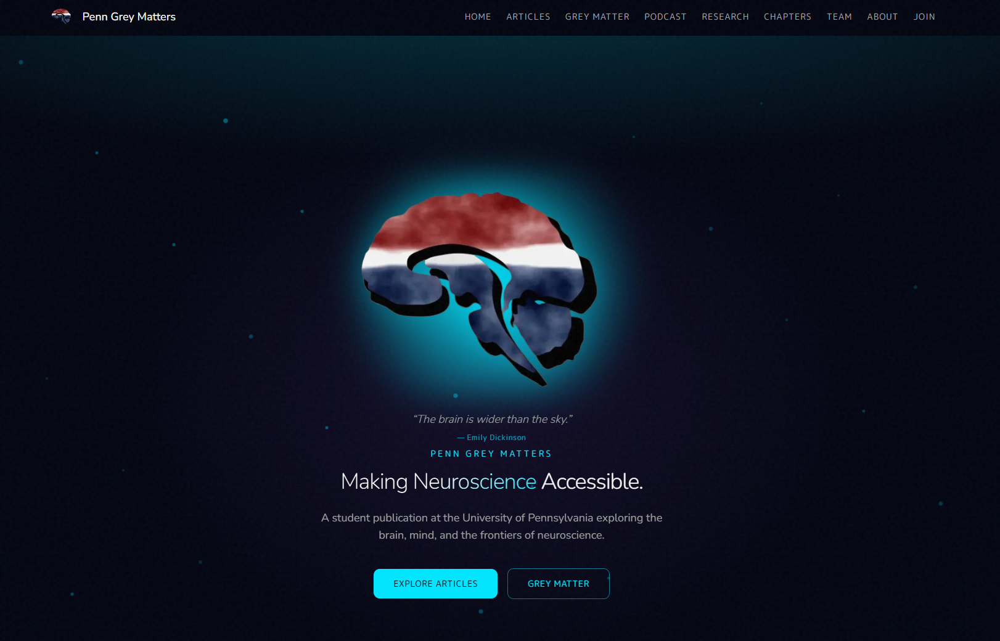
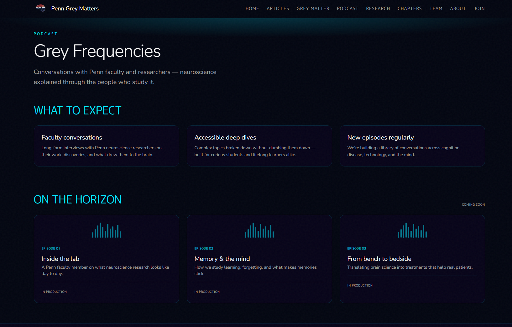
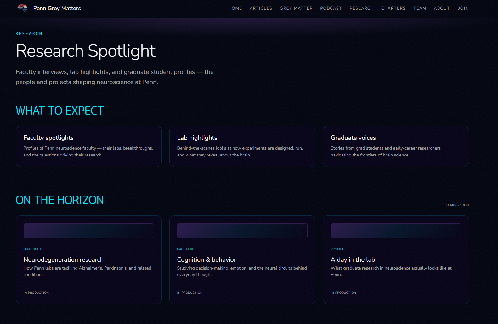
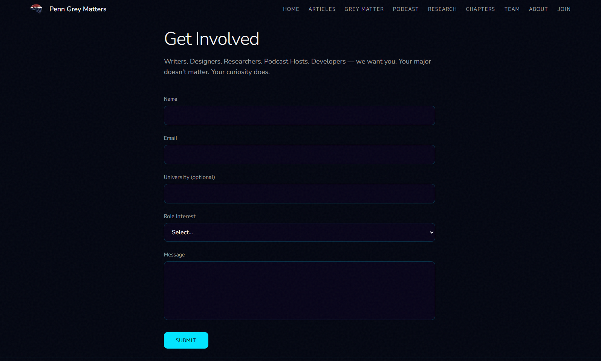
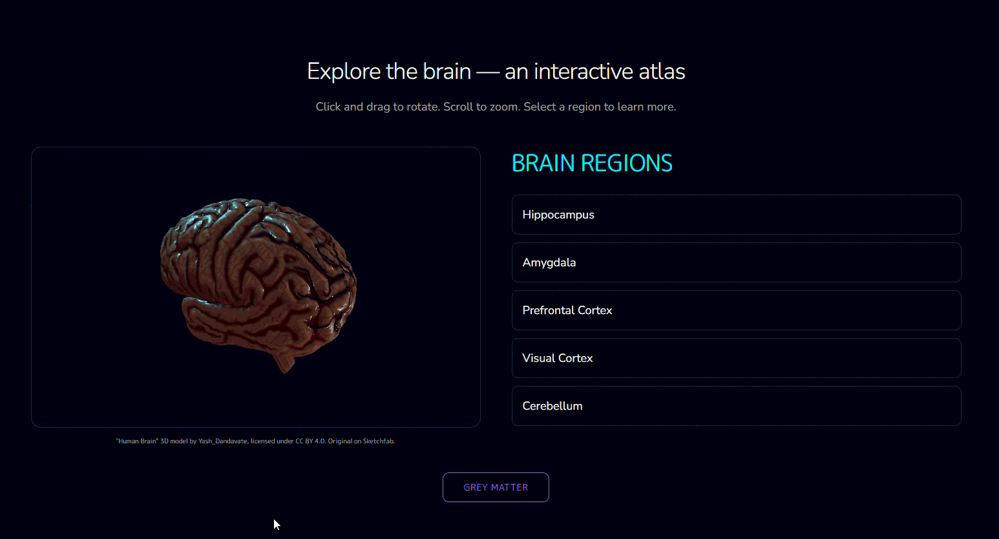

# Penn Grey Matters

<div align="center">
  
</div>

[](https://nextjs.org/)
[](https://www.typescriptlang.org/)
[](https://docs.pmnd.rs/react-three-fiber)
[](https://www.sanity.io/)

Website for **Penn Grey Matters** — the UPenn student neuroscience publication. Articles, a 3D brain you can poke at, podcast and research pages (content still rolling in), and the usual about/team/join stuff.

Built with Next.js 15, TypeScript, Tailwind v4, Framer Motion, and React Three Fiber. Content lives in JSON files for now; Sanity schema is sketched out in `sanity/schema.ts`.

## Table of Contents

- [What's on the site](#whats-on-the-site)
- [Grey Matter](#grey-matter)
- [Run it](#run-it)
- [Repo layout](#repo-layout)
- [Routes](#routes)

---

## What's on the site

**Home** opens with a preloader, then the hero expands. Below that: a scrolling row of recent articles, a neuron web that draws itself as you scroll, the about blurb, and a slice of the Grey Matter brain explorer.

<p align="center">
  
</p>

**Articles** — archive and individual post pages with related reads.

**Grey Matter** (`/explore`) — drag to rotate a 3D brain, click regions in the side panel (hippocampus, amygdala, prefrontal cortex, etc.) for functions and facts. Same layout shows up on the homepage. See [Grey Matter](#grey-matter) below.

**Podcast & Research** — Grey Frequencies (`/podcast`) and Research Spotlight (`/research`). Pages are built with coming-soon layouts; episodes and faculty spotlights get added when they're ready.

<table>
  <tr>
    <td align="center" width="50%">
      <br>
      <sub><code>/podcast</code> · Grey Frequencies</sub>
    </td>
    <td align="center" width="50%">
      <br>
      <sub><code>/research</code> · Research Spotlight</sub>
    </td>
  </tr>
</table>

**Get Involved** (`/get-involved`) — recruitment page and join form. Writers, designers, researchers, podcast hosts, devs.

<p align="center">
  
</p>

**Chapters, Team, About, Contact** — chapters map, editorial roster, mission statement, contact form.

---

## Grey Matter

3D brain model at `public/models/brain/scene.gltf`. Region copy in `data/brain-regions.json`. UI is `BrainCanvas` + `BrainRegionsPanel`, bundled as `GreyMatterExplorer`.

<p align="center">
  
</p>

---

## Run it

```bash
git clone https://github.com/tmarhguy/greymattersupenn.git
cd greymattersupenn
npm install
npm run dev
```

→ [localhost:3000](http://localhost:3000)

`.env.local` if you need forms or Sanity:

| Variable | For |
|----------|-----|
| `NEXT_PUBLIC_SANITY_PROJECT_ID` | CMS |
| `RESEND_API_KEY` | Contact / newsletter |
| `EDITORIAL_EMAIL` | Where contact submissions go |
| `APPLICATION_ADMIN_PASSWORD` | Password for Elgin’s private application confirmation dashboard |

At `/application-update`, checking the acknowledgement box saves the applicant’s
email and first confirmation time to the `APPLICATION_DB` Cloudflare D1 binding.
No acknowledgement emails are sent. Entering `elgin@sas.upenn.edu` in the lookup
opens `/application-update/admin`; a password is required before any names or
confirmation data are returned. The dashboard shows all applicants and their
confirmation status. Sessions expire after eight hours, and login attempts are
limited to ten per client per fifteen minutes. Confirmations are self-reported,
not verified email ownership or automatic page-view tracking.

Provision a D1 database with `npx wrangler d1 create greymatters-application-confirmations`
and put its ID in the `APPLICATION_DB` binding in `wrangler.jsonc`. Apply the schema
with `npx wrangler d1 migrations apply APPLICATION_DB --remote` (or `--local` for
development). Set `APPLICATION_ADMIN_PASSWORD` as a Worker secret and in
`.env.local` for local development. A missing database causes a retryable error,
never a false saved confirmation.

Run `node scripts/test-application-acknowledgements.mjs` to check acknowledgement
validation, admin access and signed sessions without sending emails.

---

## Repo layout

```
app/           pages + API routes
components/    UI (hero, articles, explore, neuron-network, …)
data/          articles.json, brain-regions.json, team, chapters
public/        images, brain model, logo
media/         screenshots for this README
sanity/        CMS schema (not wired up yet)
docs/          article migration notes
```

---

## Routes

| Path | What |
|------|------|
| `/` | Home |
| `/articles`, `/articles/[slug]` | Archive + post |
| `/explore` | Grey Matter |
| `/podcast`, `/research` | Coming soon |
| `/chapters`, `/team`, `/about` | Info |
| `/get-involved`, `/contact` | Forms |
